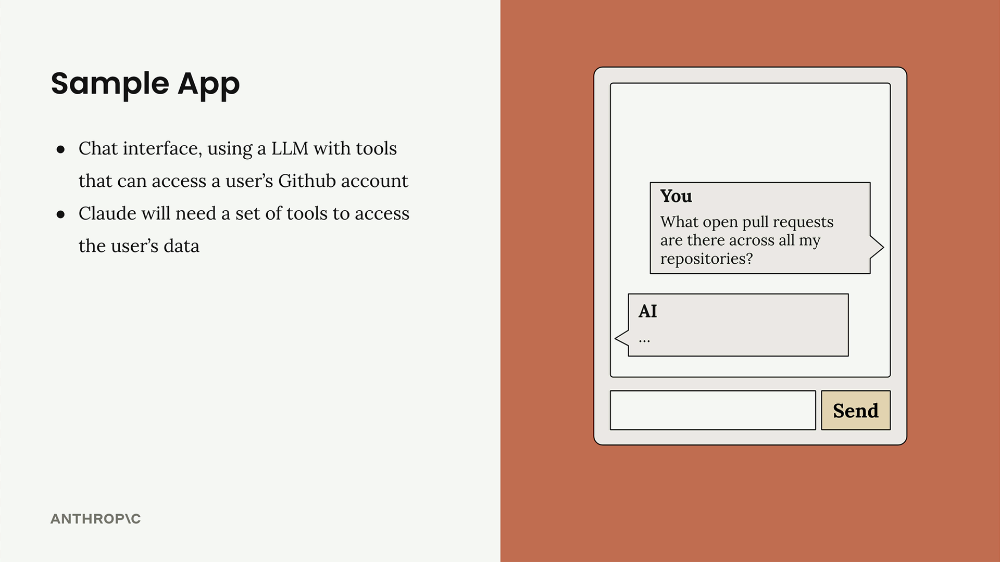
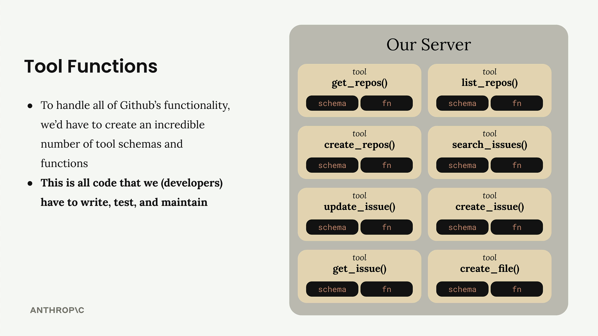
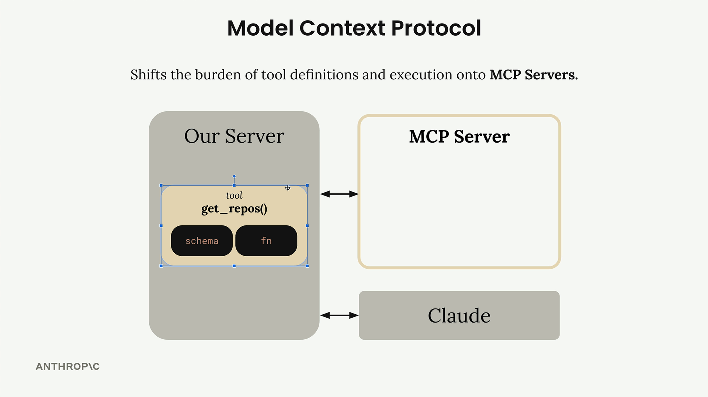
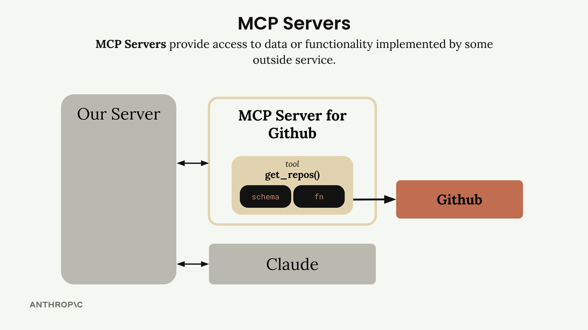

# 🔌 Model Context Protocol (MCP) – Explained

## 📝 Summary

**Model Context Protocol (MCP)** is a **communication layer** that allows Claude to access **context and tools** without requiring you to write tedious integration code.

Think of MCP as a way to **offload the burden of defining and executing tools** from your server to specialized **MCP servers**.

## 🏗️ Architecture Overview

When working with MCP, you typically see this setup:

* **MCP Client** (your server) connects to
* **MCP Servers** (which provide tools, prompts, and external resources)

Each **MCP Server** acts as a **gateway** to an outside service (e.g., GitHub, Wikipedia, etc.).

---

## ❓ The Problem MCP Solves

Imagine you're building a chat app where users can ask Claude about their **GitHub data**.

Example query:

> *"What open pull requests are there across all my repositories?"*

To answer this, Claude needs access to **GitHub’s API**.

### Without MCP:

* You must manually define all tool schemas/functions for:

  * Repositories
  * Pull requests
  * Issues
  * Projects
    ...and more.

  

* This means **writing, testing, and maintaining** all of it.
* **🛠️ Tons of integration work** just to talk to one service.

---

## 🚀 How MCP Works

With MCP, you **don't need to write the integration logic**.

Instead:

* An **MCP Server for GitHub** already defines and handles the tools (e.g., `get_repos()`, `get_pull_requests()`).
* Your server simply **connects to that MCP Server**.
* The **heavy lifting is already done** by the MCP Server implementer.

---

## 🧠 MCP Servers – What Are They?

MCP Servers provide:

* **Tools** (like `get_repos()`)
* **Prompts**
* **Resources**

They act as **standardized interfaces** to outside services.

### 🔧 Example:

The **GitHub MCP Server**:

* Wraps all the GitHub API functionality.
* Exposes it as ready-to-use tools for Claude.
* Your app uses these tools via the MCP protocol.

---

## 🙋 Common Questions

### 👤 Who authors MCP Servers?

Anyone!

* Independent developers
* Service providers (e.g., AWS might release an **official MCP server** with tools for their services)

---

### 🔄 How is this different from calling APIs directly?

| Calling APIs Manually            | Using MCP Servers                        |
| -------------------------------- | ---------------------------------------- |
| You define all tools & schemas   | Tools already defined and implemented    |
| You handle authentication, logic | MCP server does that for you             |
| High effort                      | Low effort – reuse existing integrations |

---

### ❓ Isn’t MCP just the same as tool use?

Not quite.

| Concept      | Description                                                         |
| ------------ | ------------------------------------------------------------------- |
| **Tool Use** | How Claude calls tools during reasoning                             |
| **MCP**      | Where those tools **come from** (defined by others via MCP servers) |

🔑 **Key Difference:**
With **MCP**, you’re not defining tools – you’re **using tools already defined by someone else**.

---

## ✅ Final Takeaway

> **MCP = Less Code, Less Maintenance, Faster Integrations**

Rather than maintaining complex, ever-changing integrations yourself, you can connect to an MCP server that handles it all.

Let others define the tools — you focus on building powerful, intelligent applications with Claude.

---
