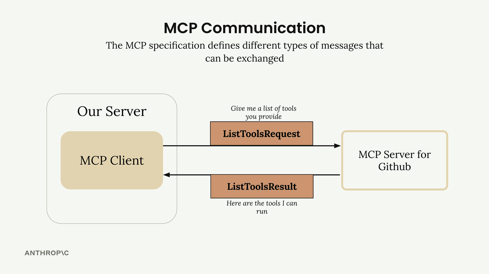
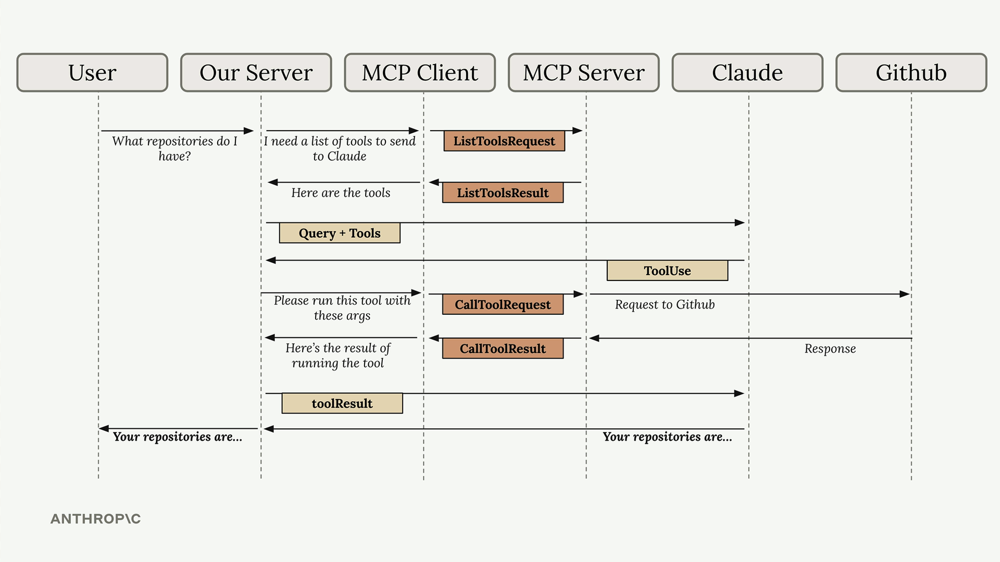

# 📡 MCP Client – Communication Bridge

## 📝 Summary

The **MCP client** serves as the communication bridge between your server and MCP servers. It's your access point to all the tools that an MCP server provides, handling the message exchange and protocol details so your application doesn't have to.

---

## 🔌 Transport Agnostic Communication

One of MCP's key strengths is being **transport agnostic** – a fancy way of saying the client and server can communicate over different protocols depending on your setup.

The most common setup runs both the MCP client and server on the same machine, communicating through **standard input/output**.
But you can also connect them over:

* HTTP
* WebSockets
* Various other network protocols

## 📨 MCP Message Types

Once connected, the client and server exchange **specific message types** defined in the MCP specification. The main ones you'll work with are:

  

* **ListToolsRequest / ListToolsResult**
  → The client asks the server *"what tools do you provide?"* and gets back a list of available tools.

  

* **CallToolRequest / CallToolResult**
  → The client asks the server to run a specific tool with given arguments, then receives the results.

---

## 🔁 How It All Works Together

Here’s a complete example showing how a user query flows through the entire system — from your server, through the MCP client, to external services like GitHub, and back to Claude.

Let’s say a user asks:

> *"What repositories do I have?"*

Here’s the step-by-step flow:

1. **User Query**: The user submits their question to your server
2. **Tool Discovery**: Your server needs to know what tools are available to send to Claude
3. **List Tools Exchange**: Your server asks the MCP client for available tools
4. **MCP Communication**: The MCP client sends a `ListToolsRequest` to the MCP server and receives a `ListToolsResult`
5. **Claude Request**: Your server sends the user's query plus the available tools to Claude
6. **Tool Use Decision**: Claude decides it needs to call a tool to answer the question
7. **Tool Execution Request**: Your server asks the MCP client to run the tool Claude specified
8. **External API Call**: The MCP client sends a `CallToolRequest` to the MCP server, which makes the actual GitHub API call
9. **Results Flow Back**: GitHub responds with repository data, which flows back through the MCP server as a `CallToolResult`
10. **Tool Result to Claude**: Your server sends the tool results back to Claude
11. **Final Response**: Claude formulates a final answer using the repository data
12. **User Gets Answer**: Your server delivers Claude's response back to the user

Yes, this flow involves many steps, but each component has a clear responsibility.
The **MCP client abstracts away** the complexity of server communication, letting you focus on your **application logic** while still getting access to **powerful external tools and data sources**.

Understanding this flow is crucial because you'll see all these pieces when building your own MCP clients and servers in the upcoming sections.

---
