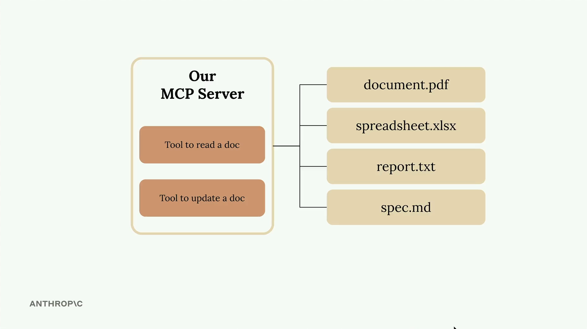

# 🗂️ Document Management Server with MCP

## Summary
Building an MCP server becomes much simpler when you use the official Python SDK. Instead of writing complex JSON schemas by hand, you can define tools with decorators and let the SDK handle the heavy lifting.

  

In this example, we're creating a document management server with two core tools: one to read documents and another to update them. All documents exist in memory as a simple dictionary where keys are document IDs and values are the content.

---

## 🛠️ Setting Up the MCP Server

The Python MCP SDK makes server creation straightforward. You can initialize a server with just one line:

```python
from mcp.server.fastmcp import FastMCP

mcp = FastMCP("DocumentMCP", log_level="ERROR")
```

Your documents can be stored in a simple dictionary structure:

```python
docs = {
    "deposition.md": "This deposition covers the testimony of Angela Smith, P.E.",
    "report.pdf": "The report details the state of a 20m condenser tower.",
    "financials.docx": "These financials outline the project's budget and expenditures",
    "outlook.pdf": "This document presents the projected future performance of the system",
    "plan.md": "The plan outlines the steps for the project's implementation.",
    "spec.txt": "These specifications define the technical requirements for the equipment"
}
```

---

## ⚙️ Tool Definition with Decorators

The SDK uses decorators to define tools. Instead of writing JSON schemas manually, you can use Python type hints and field descriptions. The SDK automatically generates the proper schema that Claude can understand.

---

## 📖 Creating a Document Reader Tool

The first tool reads document contents by ID. Here's the complete implementation:

```python
@mcp.tool(
    name="read_doc_contents",
    description="Read the contents of a document and return it as a string."
)
def read_document(
    doc_id: str = Field(description="Id of the document to read")
):
    if doc_id not in docs:
        raise ValueError(f"Doc with id {doc_id} not found")
    
    return docs[doc_id]
```

The decorator specifies the tool name and description, while the function parameters define the required arguments. The `Field` class from Pydantic provides argument descriptions that help Claude understand what each parameter expects.

---

## ✏️ Building a Document Editor Tool

The second tool performs simple find-and-replace operations on documents:

```python
@mcp.tool(
    name="edit_document",
    description="Edit a document by replacing a string in the documents content with a new string."
)
def edit_document(
    doc_id: str = Field(description="Id of the document that will be edited"),
    old_str: str = Field(description="The text to replace. Must match exactly, including whitespace."),
    new_str: str = Field(description="The new text to insert in place of the old text.")
):
    if doc_id not in docs:
        raise ValueError(f"Doc with id {doc_id} not found")
    
    docs[doc_id] = docs[doc_id].replace(old_str, new_str)
```

This tool takes three parameters: the document ID, the text to find, and the replacement text. The implementation includes error handling for missing documents and performs a straightforward string replacement.

---

## ✅ Key Benefits of the SDK Approach

* No manual JSON schema writing required
* Type hints provide automatic validation
* Clear parameter descriptions help Claude understand tool usage
* Error handling integrates naturally with Python exceptions

---
