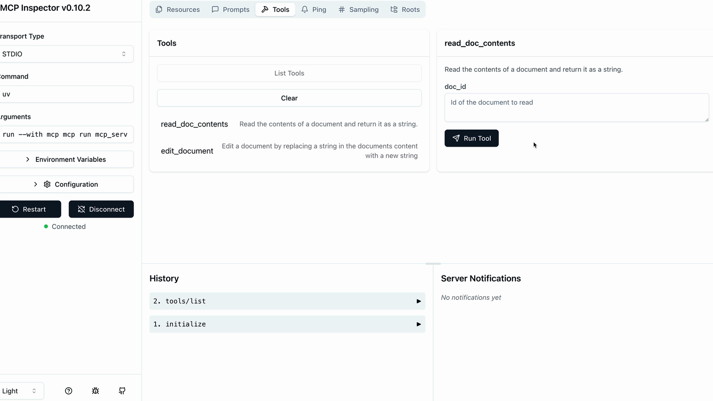

# 🧪 Summary

When building MCP servers, you need a way to test your functionality without connecting to a full application. The Python MCP SDK includes a built-in browser-based inspector that lets you debug and test your server in real-time.

---

## 🚀 Starting the Inspector

First, make sure your Python environment is activated (check your project's README for the exact command). Then run the inspector with:

```bash
mcp dev mcp_server.py
```

This starts a development server and gives you a local URL, typically something like `http://127.0.0.1:6274`. Open this URL in your browser to access the MCP Inspector.

---

## 🖥️ Using the Inspector Interface

The inspector interface is actively being developed, so it may look different when you use it. However, the core functionality remains consistent. Look for these key elements:

* A **Connect** button to start your MCP server
* Navigation tabs for **Resources**, **Tools**, **Prompts**, and other features
* A **tools listing and testing panel**

Click the **Connect** button first to initialize your server. You'll see the connection status change from **"Disconnected"** to **"Connected"**.

---

## 🧪 Testing Your Tools

Navigate to the **Tools** section and click **"List Tools"** to see all available tools from your server. When you select a tool, the right panel shows its details and input fields.



For example, to test a document reading tool:

* Select the `read_doc_contents` tool
* Enter a document ID (like `"deposition.md"`)
* Click **"Run Tool"**
* Check the results for success and expected output

The inspector shows both the **success status** and the actual **returned data**, making it easy to verify your tool works correctly.

---

## 🔁 Testing Tool Interactions

You can test multiple tools in sequence to verify complex workflows. For instance, after using an edit tool to modify a document, immediately test the read tool to confirm the changes were applied correctly.

The inspector maintains your server state between tool calls, so edits persist and you can verify the complete functionality of your MCP server.

---

## 🧰 Development Workflow

The MCP Inspector becomes an essential part of your development process. Instead of writing separate test scripts or connecting to full applications, you can:

* Quickly iterate on tool implementations
* Test edge cases and error conditions
* Verify tool interactions and state management
* Debug issues in real-time

---
