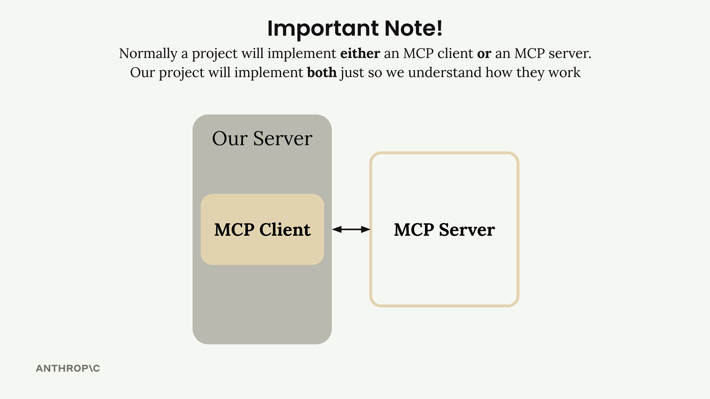
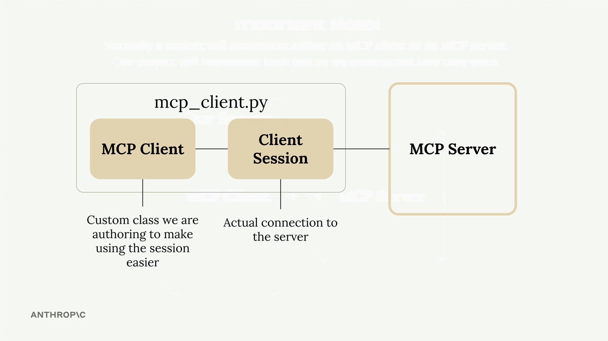
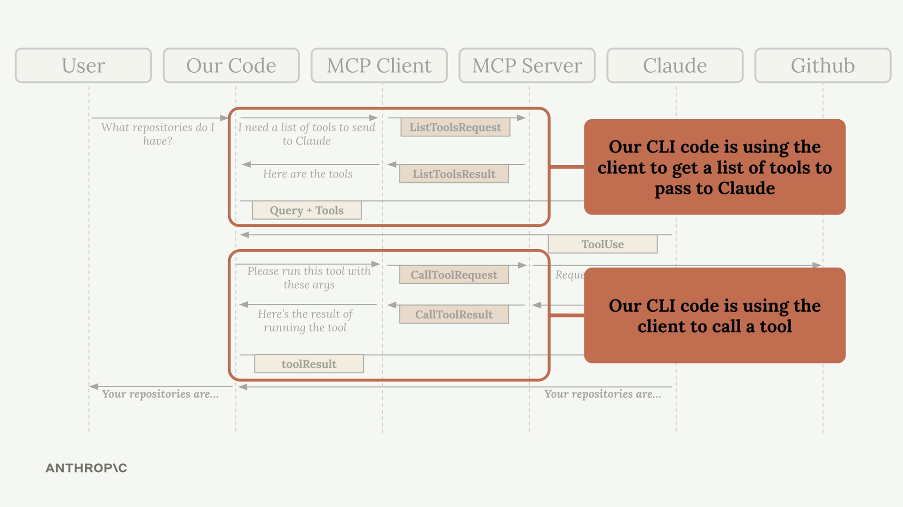

# 🧠 Summary

Now that we have our MCP server working, it's time to build the client side. The client is what allows our application code to communicate with the MCP server and access its functionality.

---

## 🏗️ Understanding the Client Architecture

In most real-world projects, you'll either implement an MCP client or an MCP server - not both. We're building both in this project just so you can see how they work together.



The MCP client consists of two main components:

* **MCP Client** - A custom class we create to make using the session easier
* **Client Session** - The actual connection to the server (part of the MCP Python SDK)



The client session requires careful resource management - we need to properly clean up connections when we're done. That's why we wrap it in our own class that handles all the cleanup automatically.

---

## 🔗 How the Client Fits Into Our Application

Remember our application flow diagram? The client is what enables our code to interact with the MCP server at two key points:



Our CLI code uses the client to:

* Get a list of available tools to send to Claude
* Execute tools when Claude requests them

---

## 🧰 Implementing Core Client Functions

We need to implement two essential functions: `list_tools()` and `call_tool()`.

### 📜 List Tools Function

This function gets all available tools from the MCP server:

```python
async def list_tools(self) -> list[types.Tool]:
    result = await self.session().list_tools()
    return result.tools
```

It's straightforward - we access our session (the connection to the server), call the built-in `list_tools()` method, and return the tools from the result.

---

### 🛠️ Call Tool Function

This function executes a specific tool on the server:

```python
async def call_tool(
    self, tool_name: str, tool_input: dict
) -> types.CallToolResult | None:
    return await self.session().call_tool(tool_name, tool_input)
```

We pass the tool name and input parameters (provided by Claude) to the server and return the result.

---

## 🧪 Testing the Client

The client file includes a simple test harness at the bottom. You can run it directly to verify everything works:

```bash
uv run mcp_client.py
```

This will connect to your MCP server and print out the available tools. You should see output showing your tool definitions, including descriptions and input schemas.

---

## 🧩 Putting It All Together

Once the client functions are implemented, you can test the complete flow by running your main application:

```bash
uv run main.py
```

Try asking:
**"What is the contents of the report.pdf document?"**

Here's what happens behind the scenes:

1. Your application uses the client to get available tools
2. These tools are sent to Claude along with your question
3. Claude decides to use the `read_doc_contents` tool
4. Your application uses the client to execute that tool
5. The result is returned to Claude, who then responds to you

---

The client acts as the **bridge** between your application logic and the MCP server's functionality, making it easy to integrate powerful tools into your AI workflows.

---
