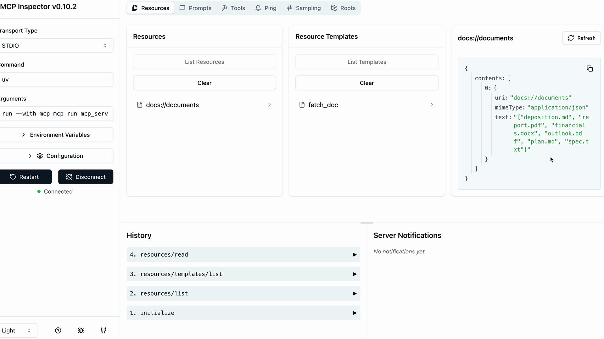

# 📘 Summary

Resources in MCP servers allow you to expose data to clients, similar to **GET request handlers** in a typical HTTP server. They're perfect for scenarios where you need to **fetch information rather than perform actions**.

---

## 🔍 Understanding Resources Through an Example

Let's say you want to build a **document mention** feature where users can type `@document_name` to reference files. This requires two operations:

* Getting a list of all available documents (for autocomplete)
* Fetching the contents of a specific document (when mentioned)  

  

When a user mentions a document, your system automatically **injects the document's contents into the prompt** sent to Claude, eliminating the need for Claude to use tools to fetch the information.

  

## ⚙️ How Resources Work

Resources follow a **request-response** pattern. When your client needs data, it sends a `ReadResourceRequest` with a URI to identify which resource it wants. The MCP server processes this request and returns the data in a `ReadResourceResult`.

  

The flow looks like this: your code requests a resource from the MCP client, which forwards the request to the MCP server. The server processes the URI, runs the appropriate function, and returns the result.

  

## 📂 Types of Resources

There are two types of resources:

### 🔸 Direct Resources

Direct resources have **static URIs** that never change. They're perfect for operations that don't need parameters.

```python
@mcp.resource(
    "docs://documents",
    mime_type="application/json"
)
def list_docs() -> list[str]:
    return list(docs.keys())
```

---

### 🔹 Templated Resources

Templated resources include **parameters in their URIs**. The Python SDK automatically parses these parameters and passes them as keyword arguments to your function.

```python
@mcp.resource(
    "docs://documents/{doc_id}",
    mime_type="text/plain"
)
def fetch_doc(doc_id: str) -> str:
    if doc_id not in docs:
        raise ValueError(f"Doc with id {doc_id} not found")
    return docs[doc_id]
```

  

## 🧾 Implementation Details

Resources can return **any type of data** – strings, JSON, binary data, etc. Use the `mime_type` parameter to give clients a hint about what kind of data you're returning:

* `"application/json"` for structured data
* `"text/plain"` for plain text
* `"application/pdf"` for binary files

The MCP Python SDK **automatically serializes** your return values. You don't need to manually convert objects to JSON strings – just return the data structure and let the SDK handle serialization.

---

## 🧪 Testing Your Resources

You can test resources using the **MCP Inspector**. Start your server with:

```bash
uv run mcp dev mcp_server.py
```

Then connect to the inspector in your browser. You'll see two sections:

* **Resources** – Lists your direct/static resources
* **Resource Templates** – Lists your templated resources

  

Click on any resource to test it. For templated resources, you'll need to provide values for the parameters. The inspector shows you the exact response structure your client will receive, including the **MIME type** and **serialized data**.

---

Resources provide a **clean way to expose read-only data** from your MCP server, making it easy for clients to fetch information **without the complexity of tool calls**.

---
