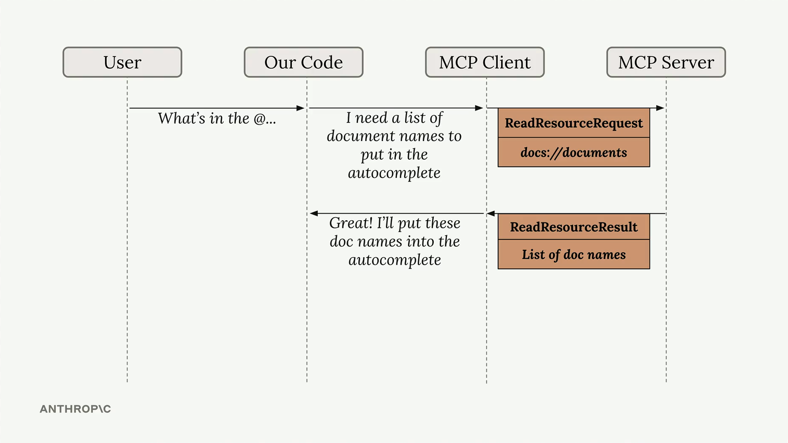

# 📘 Summary

Resources in MCP allow your server to expose information that can be directly included in prompts, rather than requiring tool calls to access data. This creates a more efficient way to provide context to AI models.

   

The diagram above shows how resources work: when a user types something like `"What's in the @..."`, our code recognizes this as a **resource request**, sends a `ReadResourceRequest` to the MCP server, and gets back a `ReadResourceResult` with the actual content.

---

## 🛠️ Implementing Resource Reading

To enable resource access in your MCP client, you need to implement a `read_resource` function.
First, add the necessary imports:

```python
import json
from pydantic import AnyUrl
```

The core function makes a request to the MCP server and processes the response based on its MIME type:

```python
async def read_resource(self, uri: str) -> Any:
    result = await self.session().read_resource(AnyUrl(uri))
    resource = result.contents[0]
    
    if isinstance(resource, types.TextResourceContents):
        if resource.mimeType == "application/json":
            return json.loads(resource.text)
    
    return resource.text
```

---

## 🧱 Understanding the Response Structure

When you request a resource, the server returns a result with a `contents` list.
We access the first element since we typically only need one resource at a time.
The response includes:

* The actual content (text or data)
* A **MIME type** that tells us how to parse the content
* Other metadata about the resource

---

## 🧾 Content Type Handling

The function checks the **MIME type** to determine how to process the content:

* If it's `application/json`, parse the text as JSON and return the parsed object
* Otherwise, return the raw text content

This approach handles both structured data (like JSON) and plain text documents seamlessly.

---

## 🧪 Testing Resource Access

Once implemented, you can test the resource functionality through your **CLI application**.
When you type `@` followed by a resource name, the system will:

* Show available resources in an autocomplete list
* Let you select a resource using arrow keys and space
* Include the resource content directly in your prompt
* Send everything to the AI model **without requiring additional tool calls**

This creates a much smoother user experience compared to having the AI model make separate tool calls to access document contents.
The resource content becomes part of the **initial context**, allowing for **immediate responses** about the data.

---
