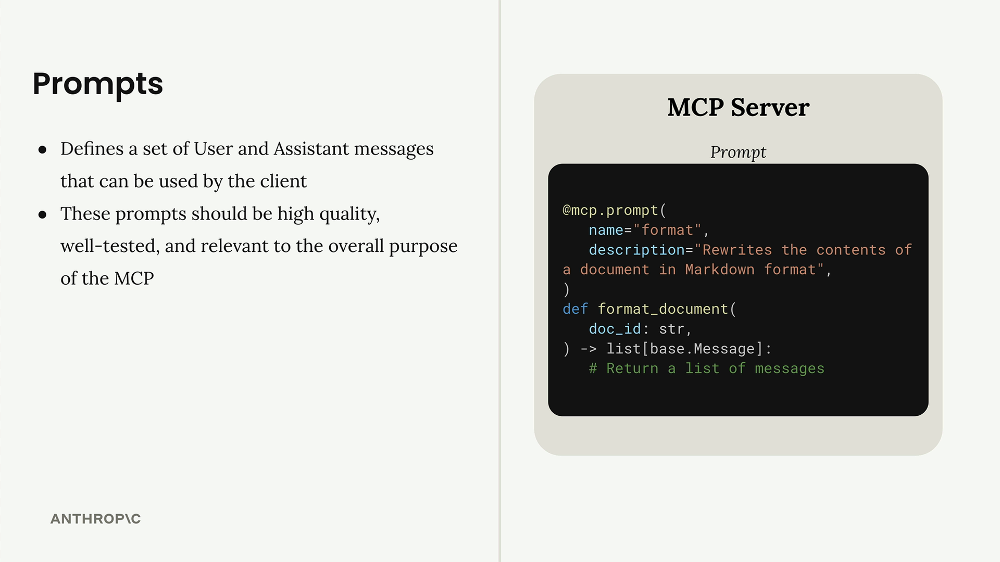

## Summary

The final step in building our MCP client is implementing prompt functionality. This allows us to list all available prompts from the server and retrieve specific prompts with variables filled in.

---

## Implementing List Prompts

The `list_prompts` method is straightforward. It calls the session's list prompts function and returns the prompts:

```python
async def list_prompts(self) -> list[types.Prompt]:
    result = await self.session().list_prompts()
    return result.prompts
```

---

## Getting Individual Prompts

The `get_prompt` method is more interesting because it handles variable interpolation. When you request a prompt, you provide arguments that get passed to the prompt function as keyword arguments:

```python
async def get_prompt(self, prompt_name, args: dict[str, str]):
    result = await self.session().get_prompt(prompt_name, args)
    return result.messages
```

For example, if your server has a `format_document` prompt that expects a `doc_id` parameter, the arguments dictionary would contain `{"doc_id": "plan.md"}`. This value gets interpolated into the prompt template.

---

## Testing Prompts in Action

Once implemented, you can test prompts through the CLI. When you type a slash (/), available prompts appear as commands. Selecting a prompt like "format" will prompt you to choose from available documents.

  

After selecting a document, the system sends the complete prompt to Claude. The AI receives both the formatting instructions and the document ID, then uses available tools to fetch and process the content.

---

## How Prompts Work

 

Prompts define a set of user and assistant messages that clients can use. They should be high-quality, well-tested, and relevant to your MCP server's purpose. The workflow is:

* Write and evaluate a prompt relevant to your server's functionality
* Define the prompt in your MCP server using the `@mcp.prompt` decorator
* Clients can request the prompt at any time
* Arguments provided by the client become keyword arguments in your prompt function
* The function returns formatted messages ready for the AI model

This system creates reusable, parameterized prompts that maintain consistency while allowing customization through variables. It's particularly useful for complex workflows where you want to ensure the AI receives properly structured instructions every time.

---
