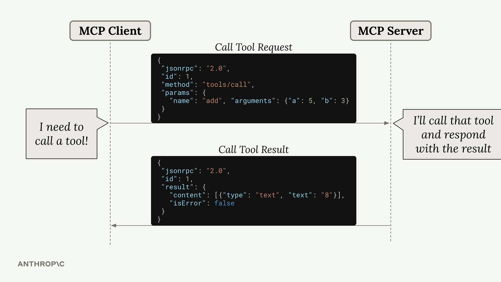
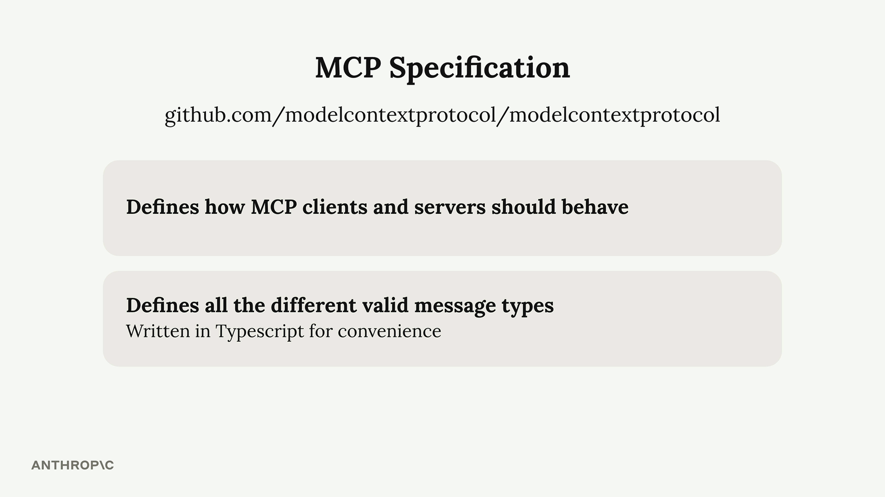
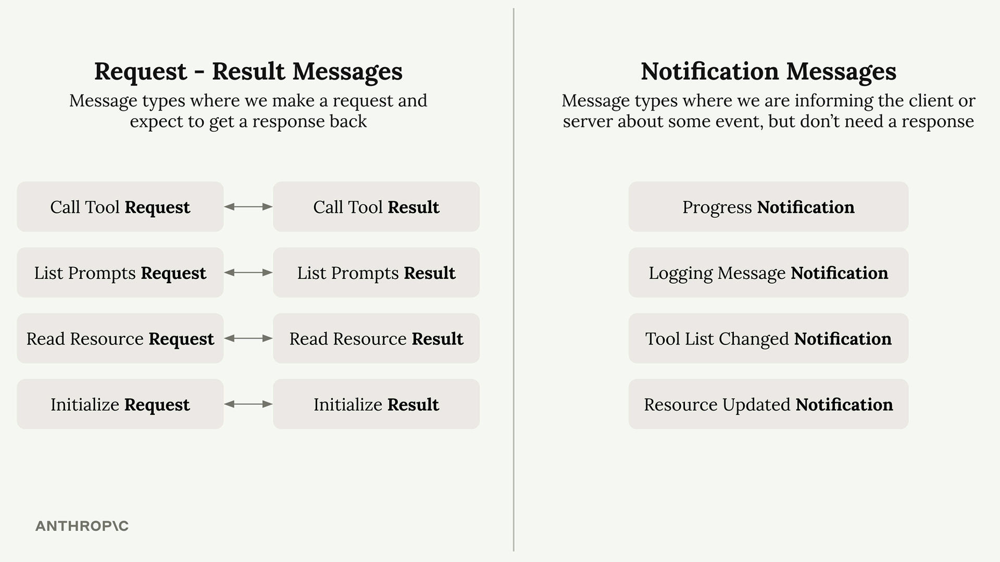

## Summary

MCP (Model Context Protocol) uses JSON messages to handle communication between clients and servers. Understanding these message types is crucial for working with MCP, especially when dealing with different transport methods like the streamable HTTP transport.

### Message Format

All MCP communication happens through JSON messages. Each message type serves a specific purpose - whether it's calling a tool, listing available resources, or sending notifications about system events.

 

Here's a typical example: when Claude needs to call a tool provided by an MCP server, the client sends a "Call Tool Request" message. The server processes this request, runs the tool, and responds with a "Call Tool Result" message containing the output.

 

### MCP Specification

The complete list of message types is defined in the official MCP specification repository on GitHub. This specification is separate from the various SDK repositories (like Python or TypeScript SDKs) and serves as the authoritative source for how MCP should work.

The message types are written in TypeScript for convenience - not because they're executed as TypeScript code, but because TypeScript provides a clear way to describe data structures and types.

### Message Categories

MCP messages fall into two main categories:

 

#### Request-Result Messages

These messages always come in pairs. You send a request and expect to get a result back:

* Call Tool Request → Call Tool Result
* List Prompts Request → List Prompts Result
* Read Resource Request → Read Resource Result
* Initialize Request → Initialize Result

#### Notification Messages

These are one-way messages that inform about events but don't require a response:

* Progress Notification - Updates on long-running operations
* Logging Message Notification - System log messages
* Tool List Changed Notification - When available tools change
* Resource Updated Notification - When resources are modified

### Client vs Server Messages

The MCP specification organizes messages by who sends them:

* **Client messages** include requests that clients send to servers (like tool calls) and notifications that clients might send.
* **Server messages** include requests that servers send to clients and notifications that servers broadcast.

### Why This Matters

Understanding that servers can send messages to clients is particularly important when working with different transport methods. Some transports, like the streamable HTTP transport, have limitations on which types of messages can flow in which directions.

The key insight is that MCP is designed as a bidirectional protocol - both clients and servers can initiate communication. This becomes crucial when you need to choose the right transport method for your specific use case.

---
