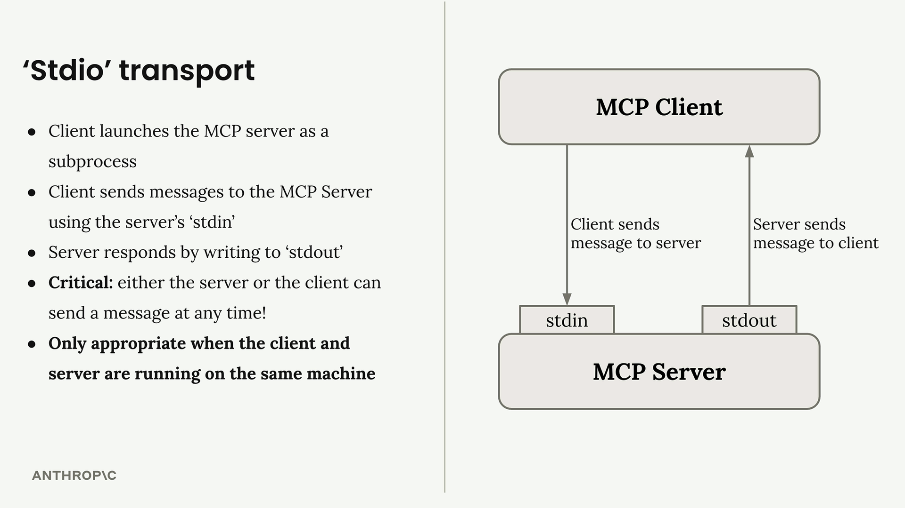
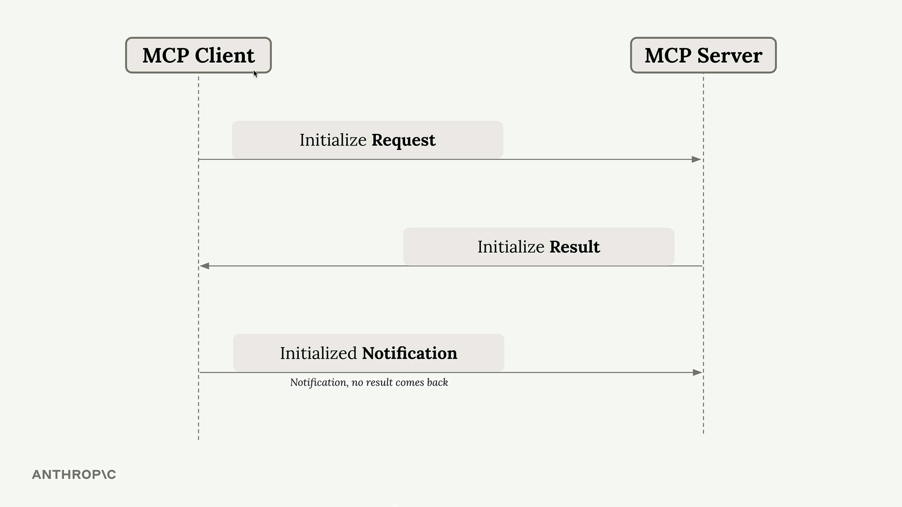
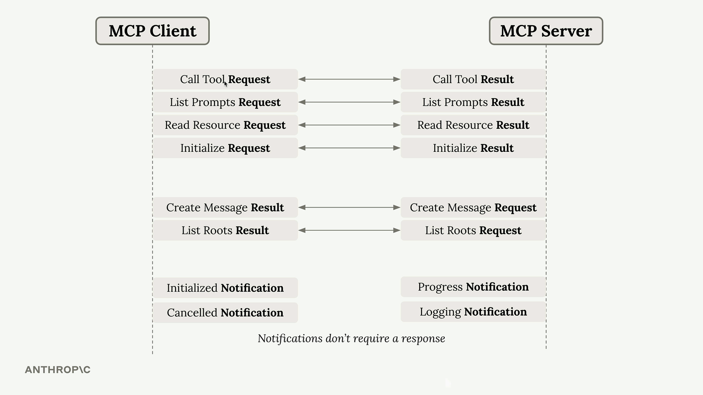
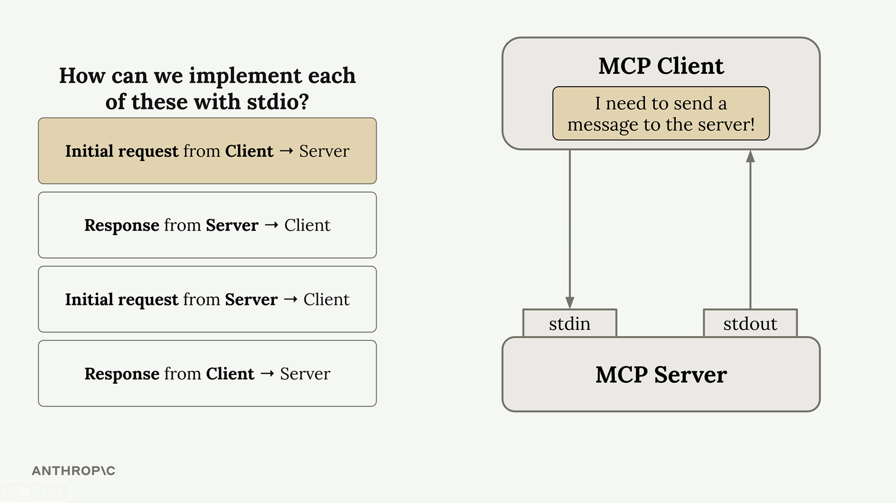

# Summary

MCP clients and servers communicate by exchanging JSON messages, but how do these messages actually get transmitted? The communication channel used is called a **transport**, and there are several ways to implement this - from HTTP requests to WebSockets to even writing JSON on a postcard (though that last one isn't recommended for production use).

---

## The Stdio Transport

When you're first developing an MCP server or client, the most commonly used transport is the **stdio transport**. This approach is straightforward: the client launches the MCP server as a subprocess and communicates through standard input and output streams.

 

### Here's how it works:
- Client sends messages to the server using the server's **stdin**
- Server responds by writing to **stdout**
- Either the server or client can send a message at any time
- Only works when client and server run on the same machine

---

## Seeing Stdio in Action

You can actually test an MCP server directly from your terminal without writing a separate client. When you run a server with:

```bash
uv run server.py
```

it listens to **stdin** and writes responses to **stdout**. This means you can paste JSON messages directly into your terminal and see the server's responses immediately.

The terminal output shows the complete message exchange, including example messages for initialization and tool calls.

---

## MCP Connection Sequence

Every MCP connection must start with a specific three-message handshake:

 

1. **Initialize Request** - Client sends this first
2. **Initialize Result** - Server responds with capabilities
3. **Initialized Notification** - Client confirms (no response expected)

Only after this handshake can you send other requests like tool calls or prompt listings.

---

## Message Types and Flow

MCP supports various message types that flow in both directions:

 

* **Requests** → **Results**
* **Notifications** (no response expected)

The key insight is that some messages require responses (requests → results) while others don't (notifications). Both client and server can initiate communication at any time.

---

## Four Communication Scenarios

With any transport, you need to handle four different communication patterns:

 

1. **Client → Server request**: Client writes to stdin
2. **Server → Client response**: Server writes to stdout
3. **Server → Client request**: Server writes to stdout
4. **Client → Server response**: Client writes to stdin

The beauty of stdio transport is its **simplicity** — either party can initiate communication at any time using these two channels.

---

## Why This Matters

Understanding **stdio transport** is crucial because it represents the "ideal" case where bidirectional communication is seamless.

When we move to other transports like **HTTP**, we'll encounter limitations where the server cannot always initiate requests to the client.

The stdio transport serves as our **baseline** for understanding what full MCP communication looks like before we tackle the constraints of other transport methods.

For **development and testing**, stdio transport is perfect.

For **production deployments** where client and server need to run on different machines, you'll need to consider other transport options with their own trade-offs.


