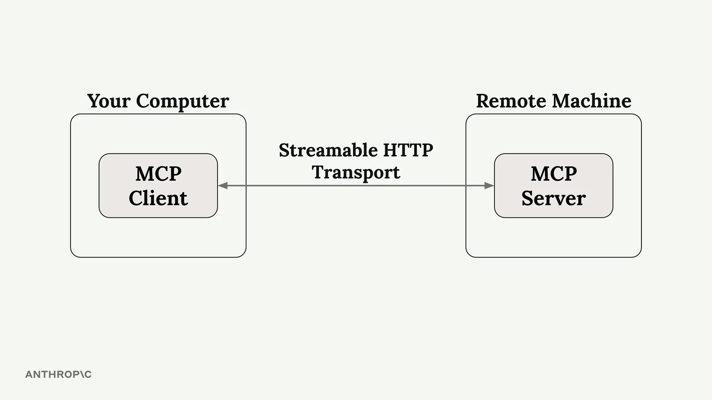
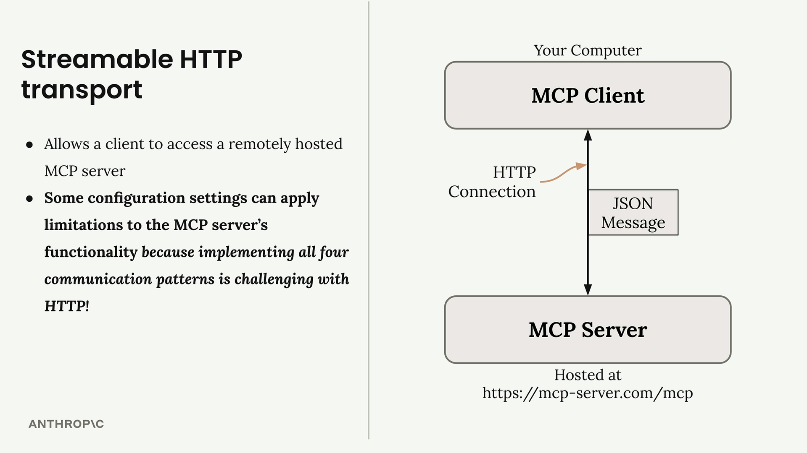
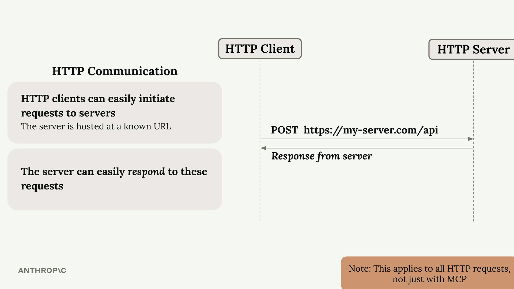
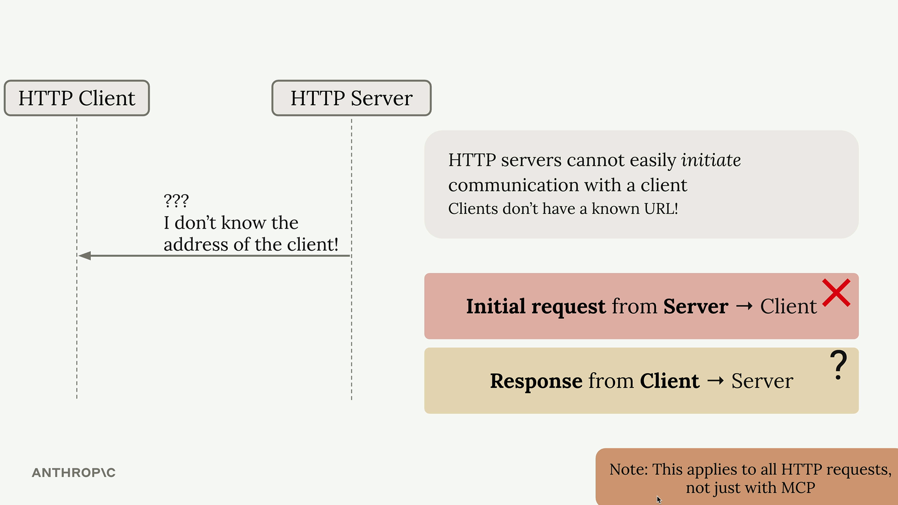
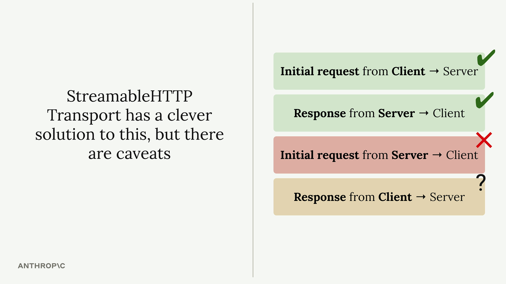

## Summary

The streamable HTTP transport enables MCP clients to connect to remotely hosted servers over HTTP connections. Unlike the standard I/O transport that requires both client and server on the same machine, this transport opens up possibilities for public MCP servers that anyone can access.

 

However, there's an important caveat: some configuration settings can significantly limit your MCP server's functionality. If your application works perfectly with standard I/O transport locally but breaks when deployed with HTTP transport, this is likely the culprit.

 

## Configuration Settings That Matter

Two key settings control how the streamable HTTP transport behaves:

- **stateless_http** - Controls connection state management  
- **json_response** - Controls response format handling  

By default, both settings are `false`, but certain deployment scenarios may force you to set them to `true`. When enabled, these settings can break core functionality like progress notifications, logging, and server-initiated requests.

---

## The HTTP Communication Challenge

To understand why these limitations exist, we need to review how HTTP communication works. In standard HTTP:

 

- Clients can easily initiate requests to servers (the server has a known URL)  
- Servers can easily respond to these requests  
- Servers cannot easily initiate requests to clients (clients don't have known URLs)  
- Response patterns from client back to server become problematic  

 

## MCP Message Types Affected

This HTTP limitation impacts specific MCP communication patterns. The following message types become difficult to implement with plain HTTP:

- **Server-initiated requests**:  
  - Create Message requests  
  - List Roots requests  

- **Notifications**:  
  - Progress notifications  
  - Logging notifications  
  - Initialized notifications  
  - Cancelled notifications  

These are exactly the features that break when you enable the restrictive HTTP settings. Progress bars disappear, logging stops working, and server-initiated sampling requests fail.

---

## The Streamable HTTP Solution

The streamable HTTP transport does provide a clever solution to work around HTTP's limitations, but it comes with trade-offs. When you're forced to use `stateless_http=True` or `json_response=True`, you're essentially telling the transport to operate within HTTP's constraints rather than working around them.

 

## Conclusion

Understanding these limitations helps you make informed decisions about:

- Which transport to use for different deployment scenarios  
- How to design your MCP server to gracefully handle HTTP constraints  
- When to accept reduced functionality for the benefits of remote hosting  

The key is knowing that these restrictions exist and planning your MCP server architecture accordingly. If your application heavily relies on server-initiated requests or real-time notifications, you may need to reconsider your transport choice or implement alternative communication patterns.
