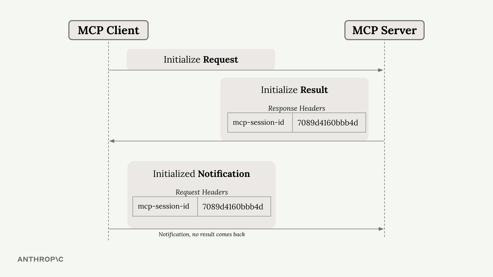
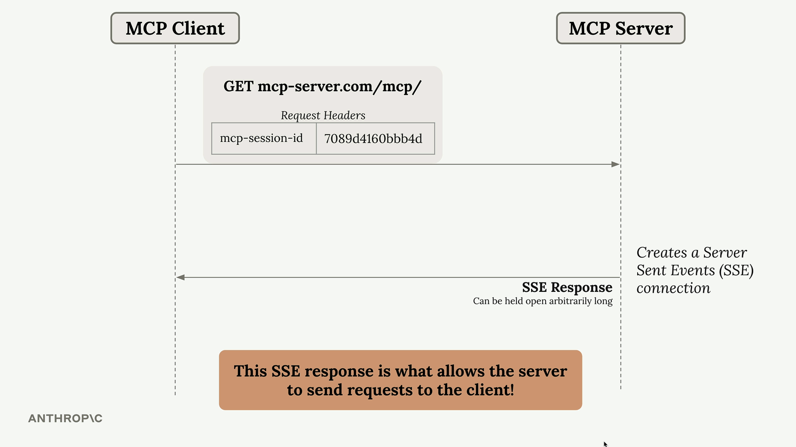
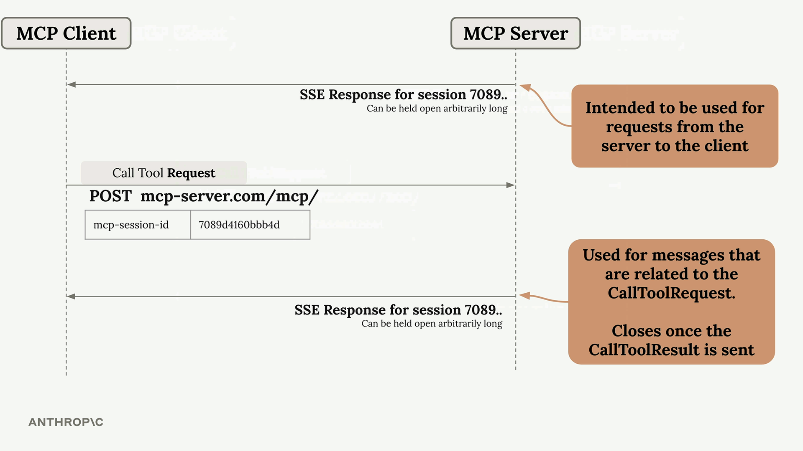
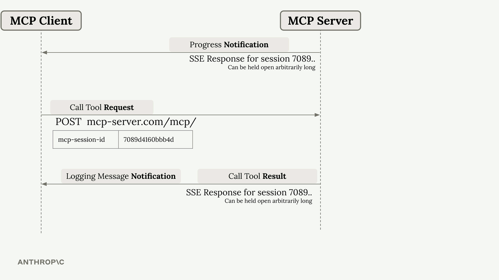

# Summary

StreamableHTTP is MCP's solution to a fundamental problem: some MCP functionality requires the server to make requests to the client, but HTTP makes this challenging. Let's explore how StreamableHTTP works around this limitation and when you might need to break that workaround.

## The Core Problem

Some MCP features like sampling, notifications, and logging rely on the server initiating requests to the client. However, HTTP is designed for clients to make requests to servers, not the other way around. StreamableHTTP solves this with a clever workaround using Server-Sent Events (SSE).

## How StreamableHTTP Works

The magic happens through a multi-step process that establishes persistent connections between client and server.

 

### Initial Connection Setup

The process starts like any MCP connection:

* Client sends an Initialize Request to the server
* Server responds with an Initialize Result that includes a special `mcp-session-id` header
* Client sends an Initialized Notification with the session ID

This session ID is crucial - it uniquely identifies the client and must be included in all future requests.

---

### The SSE Workaround

After initialization, the client can make a `GET` request to establish a **Server-Sent Events** connection. This creates a long-lived HTTP response that the server can use to stream messages back to the client at any time.

 

This SSE connection is the key to allowing server-to-client communication. The server can now send requests, notifications, and other messages through this persistent channel.

---

### Tool Calls and Dual SSE Connections

When the client makes a tool call, things get more complex. The system creates two separate SSE connections:

 

* **Primary SSE Connection**: Used for server-initiated requests and stays open indefinitely
* **Tool-Specific SSE Connection**: Created for each tool call and closes automatically when the tool result is sent

---

### Message Routing

Different types of messages get routed through different connections:

* **Progress notifications**: Sent through the primary SSE connection
* **Logging messages and tool results**: Sent through the tool-specific SSE connection

 

## Configuration Flags That Break the Workaround

StreamableHTTP includes two important configuration options:

* `stateless_http`
* `json_response`

Setting these to `True` can break the SSE workaround mechanism. You might want to enable these flags in certain scenarios, but doing so limits the full MCP functionality that depends on server-to-client communication.

---

## Key Takeaways

StreamableHTTP is more complex than other MCP transports because it has to work around HTTP's limitations. The SSE-based workaround enables full MCP functionality over HTTP, but understanding the dual-connection model is crucial for debugging and optimization.

When building MCP applications with StreamableHTTP, remember that session IDs are required for all requests after initialization, and the system automatically manages multiple SSE connections to handle different types of server-to-client communication.
