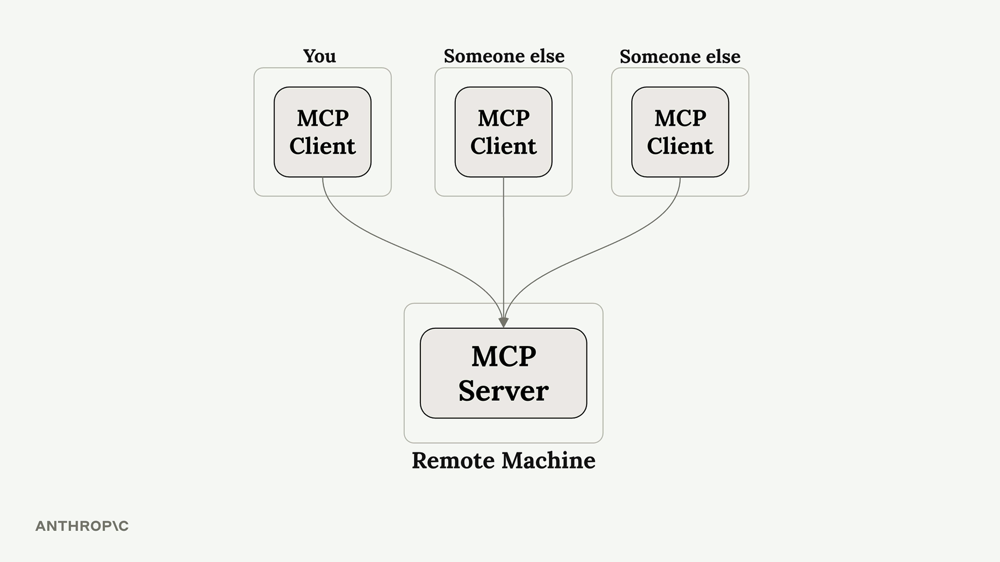
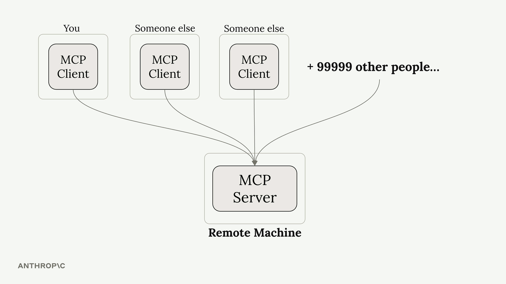
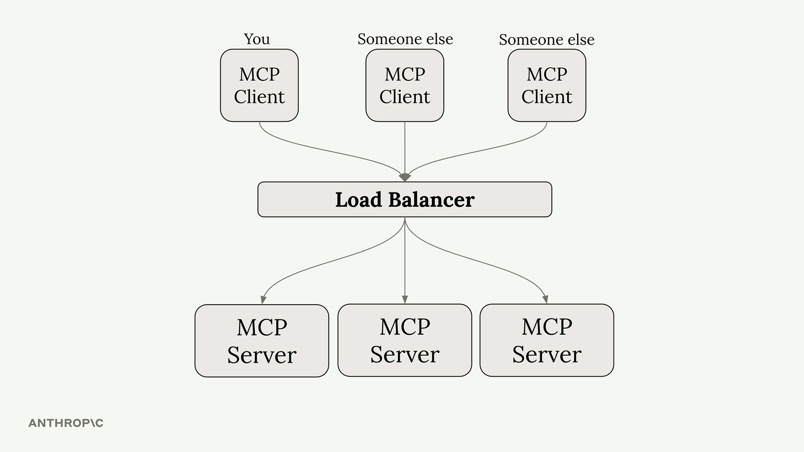
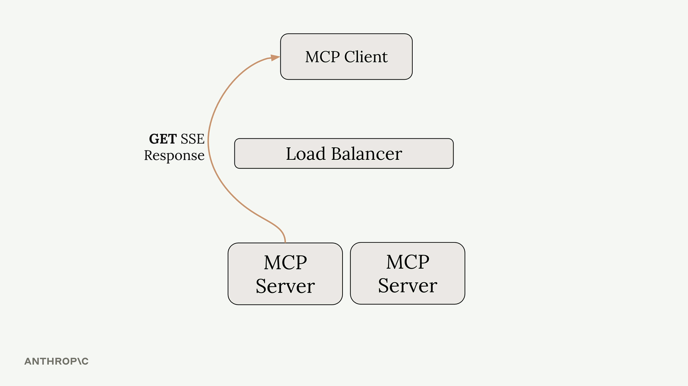
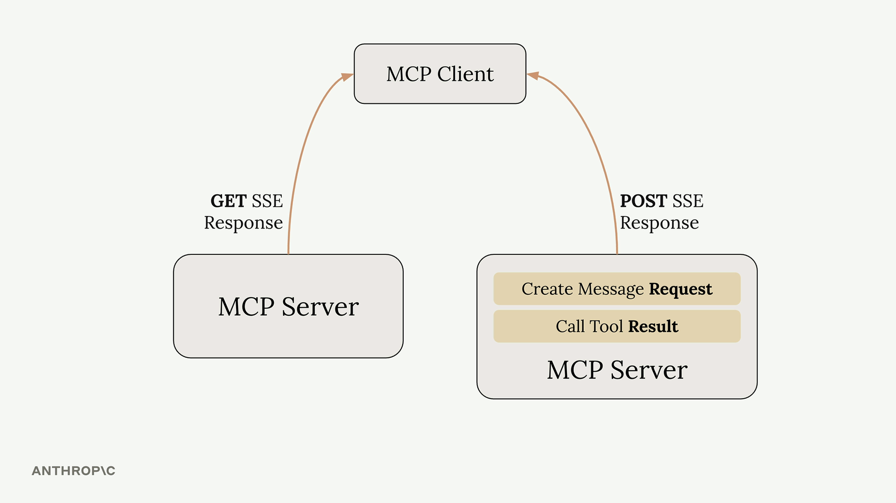
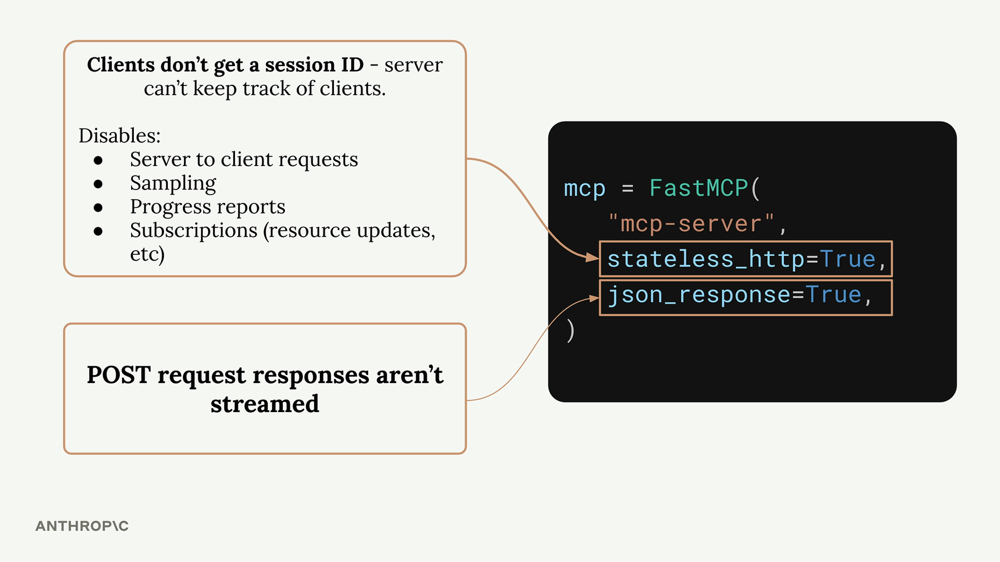
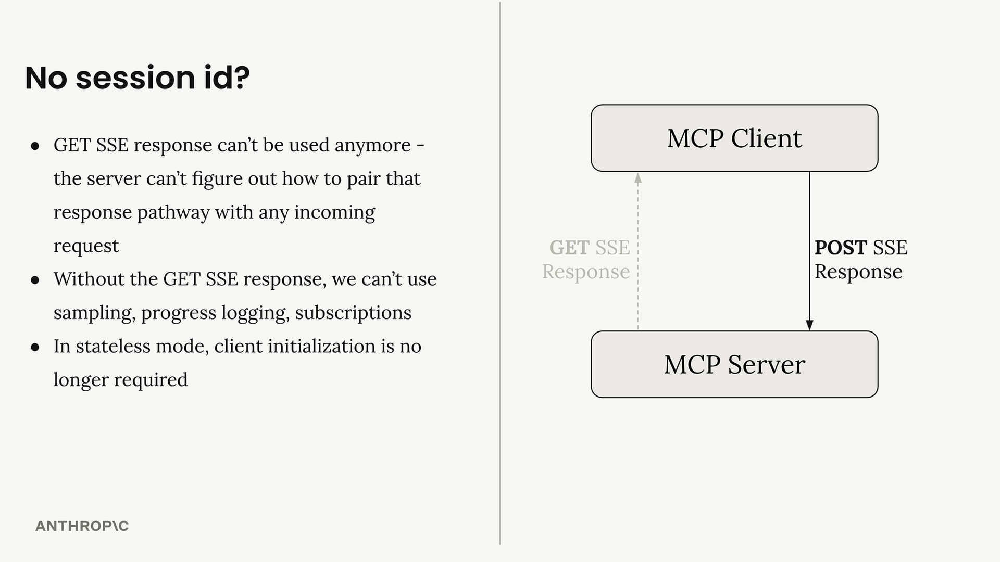

# Summary

The `stateless_http` and `json_response` flags in MCP servers control fundamental aspects of how your server behaves. Understanding when and why to use them is crucial, especially if you're planning to scale your server or deploy it in production.

## When You Need Stateless HTTP

Imagine you build an MCP server that becomes popular. Initially, you might have just a few clients connecting to a single server instance:

 

As your server grows, you might have thousands of clients trying to connect. Running a single server instance won't scale to handle all that traffic:

 

The typical solution is horizontal scaling - running multiple server instances behind a load balancer:

 

But here's where things get complicated. Remember that MCP clients need two separate connections:

- A **GET SSE** connection for receiving server-to-client requests  
- **POST** requests for calling tools and receiving responses

 

With a load balancer, these requests might get routed to different server instances. If your tool needs to use Claude (through sampling), the server handling the POST request would need to coordinate with the server handling the GET SSE connection. This creates a complex coordination problem between servers.

 

## How Stateless HTTP Solves This

Setting `stateless_http=True` eliminates this coordination problem, but with significant trade-offs:

 

When stateless HTTP is enabled:

- Clients don't get session IDs - the server can't track individual clients  
- No server-to-client requests - the GET SSE pathway becomes unavailable  
- No sampling - can't use Claude or other AI models  
- No progress reports - can't send progress updates during long operations  
- No subscriptions - can't notify clients about resource updates

However, there's one benefit: client initialization is no longer required. Clients can make requests directly without the initial handshake process.

 

## Understanding JSON Response

The `json_response=True` flag is simpler - it just disables streaming for POST request responses. Instead of getting multiple SSE messages as a tool executes, you get only the final result as plain JSON.

With streaming disabled:

- No intermediate progress messages  
- No log statements during execution  
- Just the final tool result

## When to Use These Flags

**Use stateless HTTP when:**

- You need horizontal scaling with load balancers  
- You don't need server-to-client communication  
- Your tools don't require AI model sampling  
- You want to minimize connection overhead

**Use JSON response when:**

- You don't need streaming responses  
- You prefer simpler, non-streaming HTTP responses  
- You're integrating with systems that expect plain JSON

## Development vs Production

If you're developing locally with standard I/O transport but planning to deploy with HTTP transport, test with the same transport you'll use in production. The behavior differences between stateful and stateless modes can be significant, and it's better to catch any issues during development rather than after deployment.

---

These flags fundamentally change how your MCP server operates, so choose them based on your specific scaling and functionality requirements.
