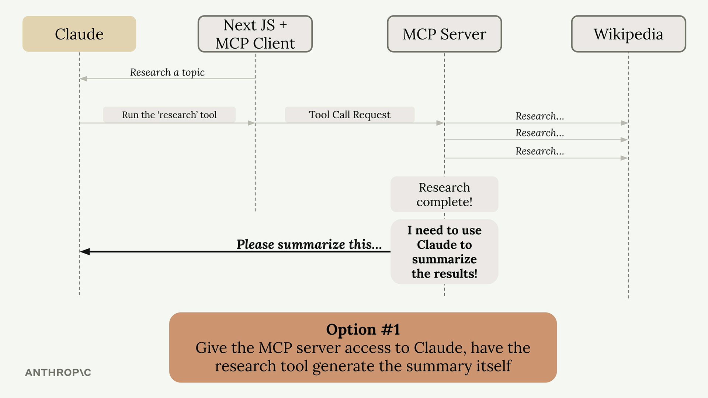
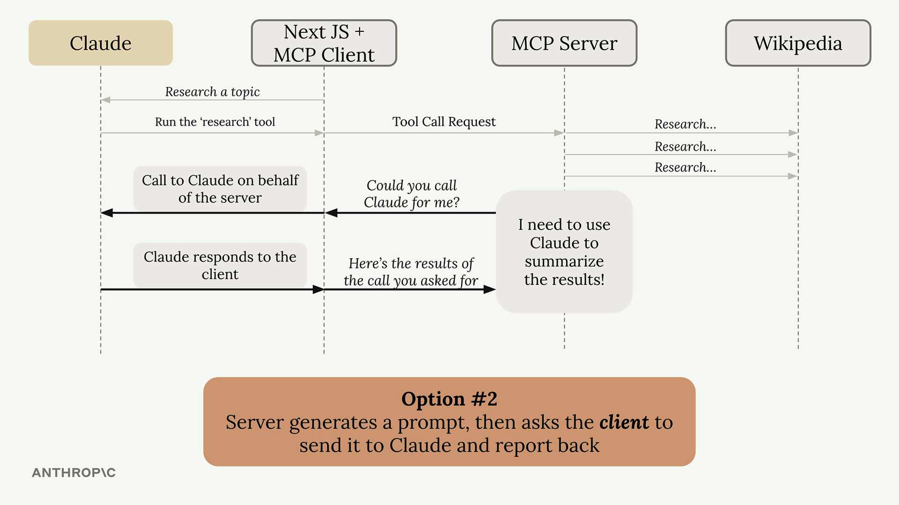

Here's your content formatted in well-structured **Markdown**:

---

# 🧪 Sampling in MCP – A Clear Overview

## 📌 Summary

**Sampling** allows a server to access a language model like **Claude** through a connected **MCP client**.
Instead of the server directly calling Claude, it asks the client to make the call on its behalf.
This shifts the **responsibility and cost of text generation** from the server to the client.

---

## 🚧 The Problem Sampling Solves

Imagine you have an MCP server with a research tool that fetches information from Wikipedia. After gathering all that data, you need to summarize it into a coherent report. You have two options:

### 🟡 Option 1: Server Calls Claude Directly



* The server gets direct access to Claude.
* Needs its own API key.
* Must handle authentication and manage costs.
* Requires full Claude integration code.
* ✅ Works, but adds **significant complexity**.

### 🟢 Option 2: Use Sampling (Recommended)



* Server generates a prompt and asks the **client**:
  *"Could you call Claude for me?"*
* Client, already connected to Claude, makes the call and returns results.

---

## 🔁 How Sampling Works

1. **Server completes its task** (e.g., fetching Wikipedia articles).
2. **Server creates a prompt** asking for text generation.
3. **Server sends a sampling request** to the client.
4. **Client calls Claude** with the provided prompt.
5. **Client returns the generated text** to the server.
6. **Server uses** the generated text in its response.

---

## ✅ Benefits of Sampling

* **Reduces server complexity:** No direct language model integration needed.
* **Shifts cost burden:** Client pays for token usage.
* **No API keys on server:** Server doesn't need Claude credentials.
* **Ideal for public servers:** Prevents unexpected costs from user-generated text.

---

## 🧩 Implementation

### 🔧 Server Side

Use the `create_message` function in your tool to request text generation:

```python
@mcp.tool()
async def summarize(text_to_summarize: str, ctx: Context):
    prompt = f"""
    Please summarize the following text:
    {text_to_summarize}
    """
    
    result = await ctx.session.create_message(
        messages=[
            SamplingMessage(
                role="user",
                content=TextContent(
                    type="text",
                    text=prompt
                )
            )
        ],
        max_tokens=4000,
        system_prompt="You are a helpful research assistant",
    )
    
    if result.content.type == "text":
        return result.content.text
    else:
        raise ValueError("Sampling failed")
```

---

### 🧑‍💻 Client Side

Create a **sampling callback** to handle the server’s request:

```python
async def sampling_callback(
    context: RequestContext, params: CreateMessageRequestParams
):
    # Call Claude using the Anthropic SDK
    text = await chat(params.messages)
    
    return CreateMessageResult(
        role="assistant",
        model=model,
        content=TextContent(type="text", text=text),
    )
```

Pass this callback when initializing the client session:

```python
async with ClientSession(
    read,
    write,
    sampling_callback=sampling_callback
) as session:
    await session.initialize()
```

---

## ⏰ When to Use Sampling

Sampling is most valuable when building **publicly accessible MCP servers**.

> You don't want random users generating unlimited text at your expense.

With sampling:

* Each **client pays for their own AI usage**.
* Server remains **lightweight, secure, and cost-efficient**.

---

**📌 Final Thought:**
Sampling moves the AI integration complexity from your server to the client — which is often **already authenticated and connected**.

---
